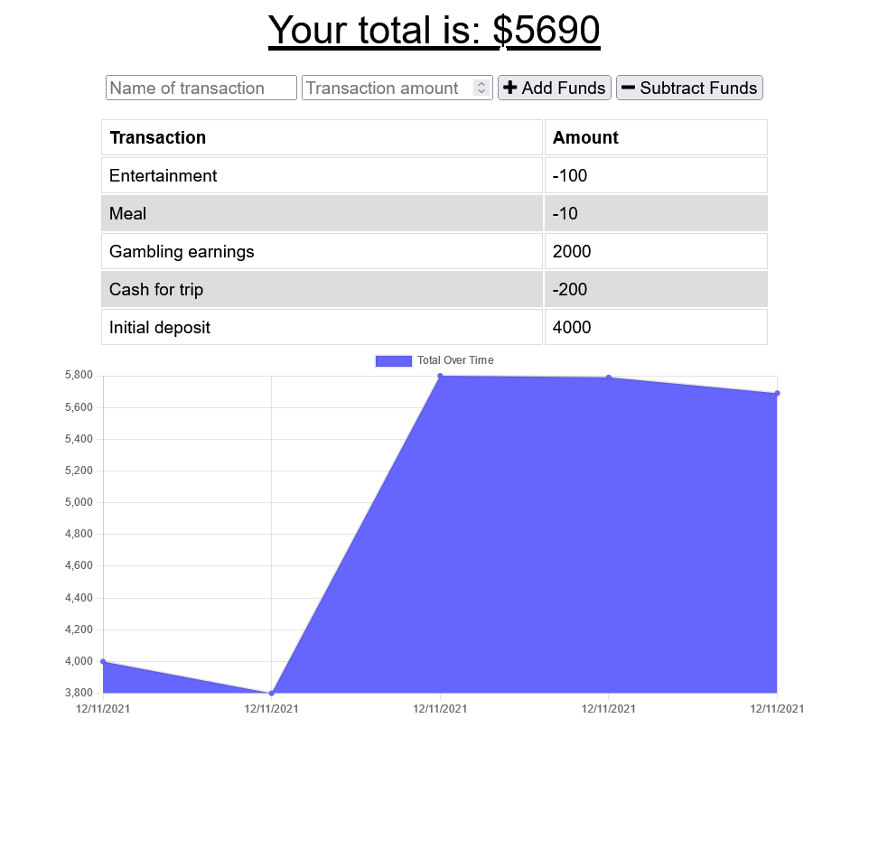

# Budget Tracker PWA [](https://opensource.org/licenses/MIT)

## Description

A simple budget tracker PWA with an offline mode using indexedDB

## Contents

- [Installation](#installation)
- [Usage](#usage)
- [Questions](#questions)
- [License](#license)

## Installation

To install this app on your computer, run the following:

```
git clone https://github.com/baker-ling/budget_tracker_pwa.git
cd budget_tracker_pwa
npm install
```

You must have a MongoDB set up as well. You can either run a MongoDB server on the same computer as that you run the app, or you can designate a server to connect to via environment variable. To do the latter, create a file named `.env` inside the root folder for the app, and type `MONGODB_URI=` followed by the URI for your online MongoDB server.

## Usage

To start the app, type:
```
npm start
```

Assuming you are running the app on your local computer, you can open it entering the URL `http://localhost:3000/` in your browser.



You might not see any transactions the first time you load it. That's okay. Just start adding transactions by typing in a name for the transaction, a numerical amount (no negative sign), and then click the "Add Funds" or "Subtract Funds" button depending on whether the transaction adds or takes away money from your budget.

You can also find a deployed version of this app [here](https://ancient-ridge-88904.herokuapp.com/).

This app can also be installed as a PWA. It will even work without being connected to the internet.

## Questions

If you have any questions, feel free to reach out via one of the following:

- Email: [brian.baker.bdb@gmail.com](mailto:brian.baker.bdb@gmail.com)
- Github: @baker-ling

## License

This application is distributed under the terms of [MIT License](./LICENSE).
